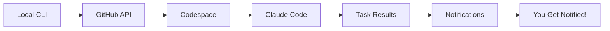

# Remote Claude

> A CLI tool for running Claude Code in GitHub Codespaces with remote task execution and notification capabilities.

[](https://badge.fury.io/js/remote-claude)
[](https://opensource.org/licenses/MIT)

## 🚀 What is Remote Claude?

Remote Claude (`rcli`) allows you to run long-running Claude Code tasks in GitHub Codespaces while you close your computer and get notified when they're done. Perfect for overnight refactoring, large-scale code analysis, or any task that would otherwise tie up your local machine.

## ✨ Key Features

- **🏗️ Remote Execution**: Run Claude Code tasks in isolated GitHub Codespaces
- **📱 Smart Notifications**: Get notified via email, Slack, or push notifications when tasks complete
- **⚡ Persistent Sessions**: Tasks continue even if you lose connection or close your laptop
- **📊 Task Management**: Queue, monitor, and manage multiple concurrent tasks
- **🔄 Git Integration**: Automatic commits and PR creation for completed work
- **📁 Result Collection**: Download outputs, logs, and artifacts automatically

## 🎯 Problem Solved

**Before Remote Claude:**
- Long-running tasks tie up your local machine
- Connection drops break task continuity  
- No way to run tasks overnight or while away
- Manual monitoring required

**After Remote Claude:**
- Start tasks and close your computer
- Get notified when work is complete
- Resume or review results anytime
- Run multiple tasks in parallel

## 📦 Installation

```bash
# Install globally via npm
npm install -g remote-claude

# Or use with npx (no installation needed)
npx remote-claude --help
```

## 🔧 Quick Setup

1. **Configure GitHub Access**
   ```bash
   rcli config github --token YOUR_GITHUB_TOKEN
   ```

2. **Set Up Notifications**
   ```bash
   rcli config notify --email your@email.com
   # Optional: Add Slack webhook
   rcli config notify --slack YOUR_SLACK_WEBHOOK_URL
   ```

3. **Run Your First Task**
   ```bash
   rcli run "Fix all TypeScript errors in the codebase" \
     --repo owner/repo \
     --notify-on-complete
   ```

## 💡 Usage Examples

### Overnight Refactoring
```bash
rcli run "Refactor payment module to use new architecture" \
  --timeout 8h \
  --notify email,slack \
  --auto-commit \
  --branch refactor/payment-module
```

### Code Review Preparation
```bash
rcli run "Review PR #123 and provide detailed feedback" \
  --repo owner/repo \
  --pr 123 \
  --output code-review.md \
  --notify email
```

### CI/CD Integration
```bash
rcli run "Analyze test failures and suggest fixes" \
  --trigger webhook \
  --context ci-failure \
  --notify slack:#dev-team
```

## 📋 Available Commands

| Command | Description |
|---------|-------------|
| `rcli run <task>` | Execute a Claude Code task remotely |
| `rcli status` | Show running and completed tasks |
| `rcli results <task-id>` | Download results from a completed task |
| `rcli config` | Manage authentication and notifications |
| `rcli logs <task-id>` | View task execution logs |
| `rcli cancel <task-id>` | Cancel a running task |

## 🏗️ How It Works



1. **CLI creates a Codespace** with Claude Code pre-installed
2. **Task executes remotely** in isolated environment
3. **Progress monitored** via webhooks and status API
4. **Results collected** automatically when complete
5. **Notifications sent** via your preferred channels
6. **Codespace cleaned up** to save costs

## 🔒 Security & Privacy

- Secure GitHub token storage using OS keychain
- Scoped permissions (minimal required access)
- Automatic cleanup of temporary files
- Optional result encryption
- Webhook signature verification

## 🤝 Contributing

We welcome contributions! Please see our [Contributing Guide](./CONTRIBUTING.md) for details.

## 📚 Documentation

- [📖 Architecture](./docs/architecture.md) - Detailed system design
- [⚙️ Setup Guide](./docs/setup-codespaces.md) - GitHub Codespaces configuration
- [🔔 Notifications](./docs/notifications.md) - Notification system setup
- [🛠️ Development](./docs/implementation-plan.md) - Development roadmap
- [❓ FAQ](./docs/faq.md) - Frequently asked questions

## 📄 License

MIT License - see [LICENSE](./LICENSE) file for details.

## 🆘 Support

- 🐛 [Report Issues](https://github.com/l2succes/remote-claude/issues)
- 💬 [Discussions](https://github.com/l2succes/remote-claude/discussions)
- 📧 Email: support@remote-claude.com

---

**Made with ❤️ for developers who want to be more productive**