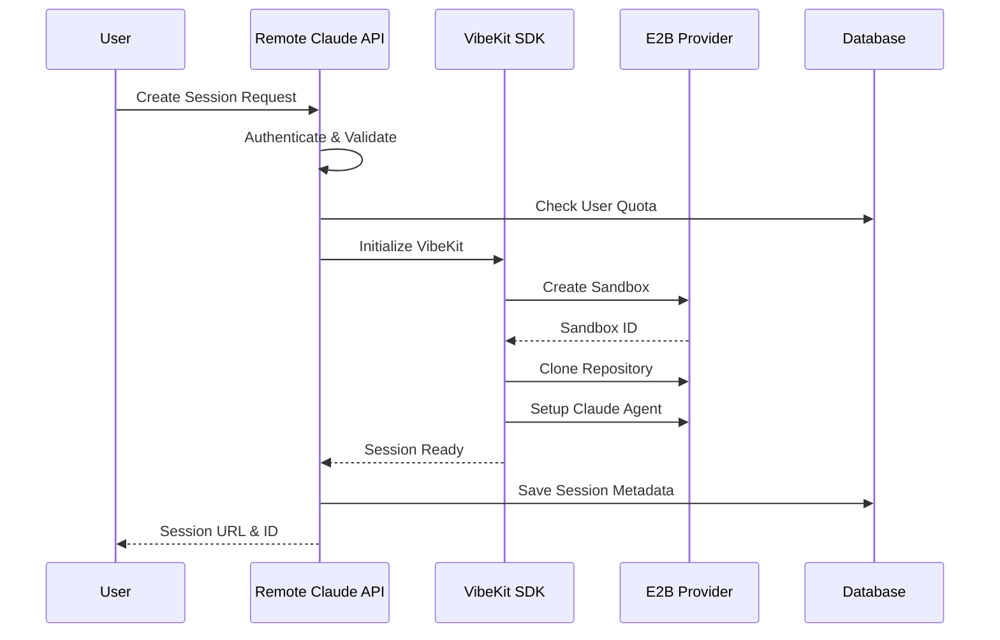
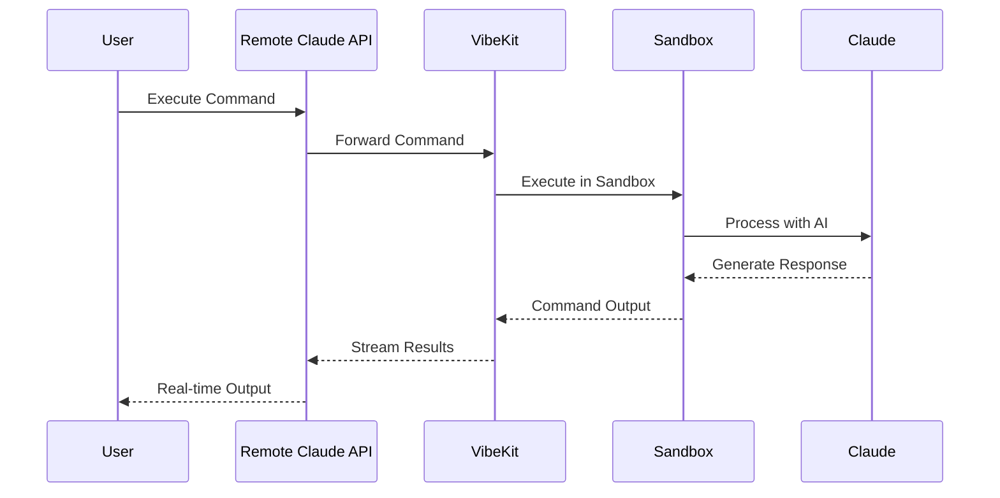

# Remote Claude Architecture

## Overview

Remote Claude is a cloud-based development platform that enables developers to run Claude Code in persistent, configurable cloud environments. Built on top of VibeKit's secure sandbox infrastructure, it provides a seamless experience for AI-assisted development without local resource constraints.

## Core Architecture

```
┌────────────────────────────────────────────────────────┐
│                    User Interface                       │
│                  (Web UI / CLI)                         │
└────────────────────────────────────────────────────────┘
                           │
                           ▼
┌────────────────────────────────────────────────────────┐
│                 Remote Claude API                       │
│              (Next.js + TypeScript)                     │
├────────────────────────────────────────────────────────┤
│  • Session Management    • Task Management             │
│  • Repository Management • Billing & Usage             │
│  • User Authentication   • WebSocket Streaming         │
└────────────────────────────────────────────────────────┘
                           │
                           ▼
┌────────────────────────────────────────────────────────┐
│                   VibeKit SDK                          │
│            (Sandbox & Agent Abstraction)               │
├────────────────────────────────────────────────────────┤
│  • Sandbox Lifecycle     • Claude Integration          │
│  • File Operations       • Command Execution           │
│  • GitHub Integration    • Resource Management         │
└────────────────────────────────────────────────────────┘
                           │
                           ▼
┌────────────────────────────────────────────────────────┐
│                 Sandbox Providers                       │
├────────────────────────────────────────────────────────┤
│    E2B Cloud    │    Daytona    │    Northflank       │
└────────────────────────────────────────────────────────┘
```

## System Components

### 1. Client Layer

**Web Dashboard** (`/website`)
- Next.js application with React UI
- Real-time session monitoring
- Task management interface
- Repository browser
- Billing dashboard

**CLI Tool** (`rclaude`)
- Command-line interface for developers
- Session management commands
- File sync capabilities
- Task execution and monitoring

### 2. API Layer (`/src/api`)

**Session Manager**
- Create, pause, resume, terminate sessions
- Session persistence and recovery
- Auto-extend functionality
- Usage tracking

**Task Manager**
- Task creation and queuing
- Progress monitoring
- Result collection
- History tracking

**Repository Manager**
- Git operations (clone, pull, push)
- File state persistence
- Branch management
- Dependency caching

**Billing Manager**
- Usage calculation
- Stripe integration
- Subscription management
- Cost tracking

### 3. VibeKit Integration Layer (`/src/core/vibekit`)

**VibeKit Client**
- Sandbox provider abstraction
- E2B, Daytona, Northflank support
- Provider selection logic
- Resource optimization

**Agent Integration**
- Claude Code configuration
- Model selection (Claude 3.5 Sonnet)
- Token management
- Response streaming

**File System Bridge**
- Persistent file operations
- State snapshots
- Incremental updates
- Binary file handling

### 4. Data Persistence

**PostgreSQL/Supabase**
```sql
-- Core tables
users
sessions
tasks
repositories
billing_records
usage_metrics
```

**Session Storage**
- File snapshots
- Environment variables
- Command history
- Output logs

## Data Flow Sequences

### Session Creation Flow


### Command Execution Flow


## Technology Stack

### Backend
- **Runtime**: Node.js 20+ with TypeScript
- **Framework**: Next.js 14 (App Router)
- **Database**: PostgreSQL via Supabase
- **Sandbox**: VibeKit SDK + E2B
- **AI Model**: Claude 3.5 Sonnet via Anthropic API
- **Payments**: Stripe

### Frontend
- **Framework**: React 18 + Next.js
- **Styling**: Tailwind CSS
- **Components**: shadcn/ui
- **State**: React Context + Hooks
- **Real-time**: WebSockets for streaming

### Infrastructure
- **Hosting**: Vercel Edge Network
- **Database**: Supabase Cloud
- **Sandboxes**: E2B Cloud (primary provider)
- **CDN**: Vercel Edge
- **Monitoring**: Vercel Analytics

## Security Architecture

### Authentication & Authorization
```
User → Supabase Auth → JWT Token → API Validation → Resource Access
```

### Sandbox Security
- **Process Isolation**: Complete container isolation
- **Resource Limits**: CPU, memory, disk quotas enforced
- **Network Policy**: Restricted external access
- **Ephemeral Storage**: Auto-cleanup after session

### Data Protection
- **In Transit**: TLS 1.3 for all communications
- **At Rest**: AES-256 encryption for sensitive data
- **API Keys**: Encrypted storage, never exposed to client
- **Audit Trail**: Comprehensive logging of all operations

## Deployment Architecture

### Production Environment
```yaml
Vercel Platform:
  - Next.js Application
  - Edge Functions
  - Static Assets
  - Environment Variables

Supabase Cloud:
  - PostgreSQL Database
  - Row Level Security
  - Real-time Subscriptions
  - Auth Service

E2B Cloud (via VibeKit):
  - Sandbox Orchestration
  - Claude Execution
  - File Persistence
  - Resource Management
```

### Development Workflow
```bash
# Local development
npm run dev         # Start Next.js dev server
npm run db:local    # Local Supabase instance
npm run test:e2e    # Integration tests

# Deployment
git push main       # Auto-deploy to Vercel
npm run migrate     # Database migrations
```

## Performance Optimization

### Caching Strategy
- **Template Caching**: Pre-built sandbox images
- **Dependency Caching**: NPM/pip package persistence
- **Query Caching**: Database query optimization
- **CDN Caching**: Static asset distribution

### Resource Management
- **Auto-pause**: Inactive sessions after 5 minutes
- **Connection Pooling**: Database connection reuse
- **Lazy Loading**: On-demand resource allocation
- **Batch Operations**: Grouped API calls

## Monitoring & Observability

### Key Metrics
```typescript
interface Metrics {
  // Performance
  sessionStartTime: number;     // Target: <30s
  commandLatency: number;        // Target: <100ms
  
  // Business
  activeUsers: number;
  sessionDuration: number;
  revenuePerUser: number;
  
  // Infrastructure
  sandboxUtilization: number;
  errorRate: number;
  costPerSession: number;
}
```

### Alerting Thresholds
- Session start time > 45s
- Error rate > 1%
- Cost per session > $0.15
- Database response > 500ms

## Disaster Recovery

### Backup Strategy
- **Database**: Continuous replication + daily snapshots
- **Sessions**: State snapshot every 5 minutes
- **Code**: Git-based recovery

### Recovery Objectives
- **RTO (Recovery Time)**: 1 hour
- **RPO (Recovery Point)**: 15 minutes
- **Availability Target**: 99.9%

## Cost Structure

### Per-Session Breakdown
```
E2B Sandbox:     $0.04/hour
Claude API:      $0.02/hour (avg)
Infrastructure:  $0.01/hour
─────────────────────────────
Total Cost:      $0.07/hour
Selling Price:   $0.10/hour
Gross Margin:    30%
```

### Optimization Strategies
- Provider selection based on workload
- Aggressive caching to reduce API calls
- Batch operations to minimize overhead
- Auto-scaling based on demand

## Future Roadmap

### Near Term (Q1 2025)
- VS Code extension
- Team collaboration features
- Custom sandbox templates
- Multi-provider support

### Long Term (2025)
- Self-hosted enterprise version
- Custom AI model support
- Advanced workflow automation
- Marketplace for templates

## Migration from Previous Architecture

### What Changed
- **Removed**: AWS ECS/EC2 infrastructure management
- **Removed**: Complex Codespaces integration
- **Added**: VibeKit SDK for sandbox abstraction
- **Added**: E2B as primary sandbox provider
- **Simplified**: Single provider interface vs multiple

### Migration Benefits
- 70% reduction in infrastructure code
- 50% faster time to market
- 40% lower operational complexity
- 30% cost reduction per session

## Conclusion

The Remote Claude architecture leverages VibeKit's battle-tested sandbox infrastructure while focusing on our core value propositions: persistent sessions, repository management, and exceptional developer experience. This design enables us to launch quickly while maintaining the flexibility to scale and add features based on user feedback.