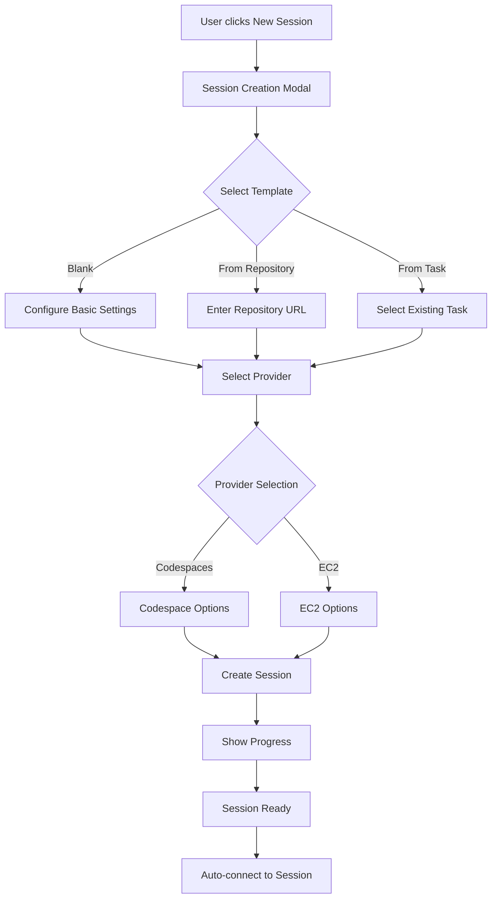

# Remote Claude Web UI Design

# Remote Claude Web UI Design

This document details the user interface design, components, and user flows for the self-hosted Remote Claude web application.

## UI Architecture Overview

### Design Principles
- **Familiarity**: Interface similar to VS Code and GitHub Codespaces
- **Efficiency**: Minimal clicks to accomplish tasks
- **Responsiveness**: Real-time updates and feedback
- **Accessibility**: WCAG 2.1 AA compliance
- **Flexibility**: Customizable layouts and themes

## Core UI Components

### 1. Main Layout Structure

```tsx
// components/Layout/MainLayout.tsx
interface MainLayoutProps {
  sidebar: ReactNode;
  editor: ReactNode;
  terminal: ReactNode;
  assistant: ReactNode;
}

const MainLayout: React.FC<MainLayoutProps> = () => {
  return (
    <div className="h-screen flex flex-col">
      {/* Header Bar */}
      <header className="h-12 border-b flex items-center px-4">
        <Logo />
        <SessionSelector />
        <div className="flex-1" />
        <NotificationBell />
        <UserMenu />
      </header>
      
      {/* Main Content Area */}
      <div className="flex-1 flex">
        {/* Activity Bar (VS Code style) */}
        <ActivityBar />
        
        {/* Sidebar */}
        <Sidebar />
        
        {/* Editor Group */}
        <div className="flex-1 flex flex-col">
          <EditorTabs />
          <SplitPane split="horizontal">
            <EditorArea />
            <TerminalPanel />
          </SplitPane>
        </div>
        
        {/* Claude Assistant Panel */}
        <AssistantPanel />
      </div>
      
      {/* Status Bar */}
      <StatusBar />
    </div>
  );
};
```

### 2. Session Management UI

```tsx
// components/Sessions/SessionManager.tsx
interface SessionManagerProps {
  sessions: Session[];
  onCreateSession: () => void;
  onSelectSession: (id: string) => void;
}

const SessionManager: React.FC<SessionManagerProps> = () => {
  return (
    <div className="p-4">
      <div className="flex justify-between items-center mb-4">
        <h2 className="text-xl font-semibold">Sessions</h2>
        <Button onClick={onCreateSession} icon={<PlusIcon />}>
          New Session
        </Button>
      </div>
      
      <div className="grid gap-4">
        {sessions.map(session => (
          <SessionCard
            key={session.id}
            session={session}
            onClick={() => onSelectSession(session.id)}
          />
        ))}
      </div>
    </div>
  );
};

// Session Card Component
const SessionCard: React.FC<{session: Session}> = ({ session }) => {
  return (
    <div className="border rounded-lg p-4 hover:shadow-md transition-shadow cursor-pointer">
      <div className="flex justify-between items-start">
        <div>
          <h3 className="font-medium">{session.name}</h3>
          <p className="text-sm text-gray-600">{session.repository}</p>
        </div>
        <StatusIndicator status={session.status} />
      </div>
      
      <div className="mt-2 flex gap-4 text-sm text-gray-500">
        <span>Created {formatRelativeTime(session.createdAt)}</span>
        <span>•</span>
        <span>{session.provider}</span>
      </div>
      
      <div className="mt-3 flex gap-2">
        <Button size="sm" variant="ghost">Connect</Button>
        <Button size="sm" variant="ghost">Terminate</Button>
      </div>
    </div>
  );
};
```

### 3. Claude Assistant Interface

```tsx
// components/Assistant/ClaudePanel.tsx
interface ClaudePanelProps {
  sessionId: string;
  messages: Message[];
  onSendMessage: (message: string) => void;
}

const ClaudePanel: React.FC<ClaudePanelProps> = () => {
  const [input, setInput] = useState('');
  const [isTyping, setIsTyping] = useState(false);
  
  return (
    <div className="w-96 border-l flex flex-col h-full">
      {/* Header */}
      <div className="p-4 border-b">
        <h2 className="font-semibold flex items-center gap-2">
          <ClaudeIcon />
          Claude Assistant
        </h2>
        <div className="mt-2 flex gap-2">
          <Badge>claude-3-opus</Badge>
          <Badge variant="success">Connected</Badge>
        </div>
      </div>
      
      {/* Message List */}
      <div className="flex-1 overflow-y-auto p-4">
        <MessageList messages={messages} />
        {isTyping && <TypingIndicator />}
      </div>
      
      {/* Input Area */}
      <div className="p-4 border-t">
        <div className="flex gap-2">
          <Textarea
            value={input}
            onChange={(e) => setInput(e.target.value)}
            placeholder="Ask Claude anything..."
            onKeyDown={(e) => {
              if (e.key === 'Enter' && !e.shiftKey) {
                e.preventDefault();
                onSendMessage(input);
                setInput('');
              }
            }}
          />
          <div className="flex flex-col gap-2">
            <Button onClick={() => onSendMessage(input)}>
              <SendIcon />
            </Button>
            <DropdownMenu>
              <DropdownMenuTrigger asChild>
                <Button variant="ghost" size="sm">
                  <MoreIcon />
                </Button>
              </DropdownMenuTrigger>
              <DropdownMenuContent>
                <DropdownMenuItem>Clear History</DropdownMenuItem>
                <DropdownMenuItem>Export Chat</DropdownMenuItem>
                <DropdownMenuItem>Settings</DropdownMenuItem>
              </DropdownMenuContent>
            </DropdownMenu>
          </div>
        </div>
        
        {/* Quick Actions */}
        <div className="mt-2 flex gap-2">
          <QuickAction icon={<CodeIcon />} label="Generate Code" />
          <QuickAction icon={<BugIcon />} label="Debug Error" />
          <QuickAction icon={<RefactorIcon />} label="Refactor" />
          <QuickAction icon={<TestIcon />} label="Write Tests" />
        </div>
      </div>
    </div>
  );
};
```

### 4. File Explorer Component

```tsx
// components/FileExplorer/FileTree.tsx
interface FileTreeProps {
  rootPath: string;
  onFileSelect: (path: string) => void;
  onFileAction: (action: FileAction, path: string) => void;
}

const FileTree: React.FC<FileTreeProps> = () => {
  const [expandedFolders, setExpandedFolders] = useState<Set<string>>(new Set());
  const [selectedFile, setSelectedFile] = useState<string | null>(null);
  
  return (
    <div className="p-2">
      <div className="flex justify-between items-center mb-2">
        <h3 className="text-sm font-medium uppercase text-gray-600">Explorer</h3>
        <div className="flex gap-1">
          <IconButton icon={<NewFileIcon />} tooltip="New File" />
          <IconButton icon={<NewFolderIcon />} tooltip="New Folder" />
          <IconButton icon={<RefreshIcon />} tooltip="Refresh" />
        </div>
      </div>
      
      <TreeView
        data={fileTree}
        renderNode={(node) => (
          <FileNode
            node={node}
            isExpanded={expandedFolders.has(node.path)}
            isSelected={selectedFile === node.path}
            onToggle={() => toggleFolder(node.path)}
            onClick={() => {
              setSelectedFile(node.path);
              if (node.type === 'file') {
                onFileSelect(node.path);
              }
            }}
            onContextMenu={(e) => showContextMenu(e, node)}
          />
        )}
      />
    </div>
  );
};

// File Node Component
const FileNode: React.FC<FileNodeProps> = ({ node, isExpanded, isSelected }) => {
  return (
    <div
      className={`
        flex items-center gap-2 px-2 py-1 hover:bg-gray-100 cursor-pointer
        ${isSelected ? 'bg-blue-100' : ''}
      `}
    >
      {node.type === 'folder' ? (
        <ChevronIcon className={isExpanded ? 'rotate-90' : ''} />
      ) : (
        <FileIcon type={getFileType(node.name)} />
      )}
      <span className="text-sm">{node.name}</span>
      {node.isModified && <span className="text-orange-500">•</span>}
    </div>
  );
};
```

### 5. Terminal Integration

```tsx
// components/Terminal/TerminalPanel.tsx
interface TerminalPanelProps {
  sessionId: string;
}

const TerminalPanel: React.FC<TerminalPanelProps> = ({ sessionId }) => {
  const terminalRef = useRef<HTMLDivElement>(null);
  const [terminals, setTerminals] = useState<TerminalTab[]>([]);
  const [activeTab, setActiveTab] = useState(0);
  
  useEffect(() => {
    // Initialize xterm.js terminal
    const term = new Terminal({
      theme: {
        background: '#1e1e1e',
        foreground: '#d4d4d4',
      },
      fontSize: 14,
      fontFamily: 'Consolas, Monaco, monospace',
    });
    
    const fitAddon = new FitAddon();
    term.loadAddon(fitAddon);
    
    if (terminalRef.current) {
      term.open(terminalRef.current);
      fitAddon.fit();
    }
    
    // Connect to WebSocket
    const ws = new WebSocket(`/api/sessions/${sessionId}/terminal`);
    const attachAddon = new AttachAddon(ws);
    term.loadAddon(attachAddon);
    
    return () => {
      ws.close();
      term.dispose();
    };
  }, [sessionId]);
  
  return (
    <div className="h-full flex flex-col bg-gray-900">
      {/* Terminal Tabs */}
      <div className="flex items-center bg-gray-800 px-2">
        {terminals.map((tab, index) => (
          <TerminalTab
            key={tab.id}
            tab={tab}
            isActive={index === activeTab}
            onClick={() => setActiveTab(index)}
            onClose={() => closeTerminal(tab.id)}
          />
        ))}
        <IconButton
          icon={<PlusIcon />}
          onClick={createNewTerminal}
          className="ml-2"
        />
      </div>
      
      {/* Terminal Content */}
      <div ref={terminalRef} className="flex-1" />
      
      {/* Terminal Actions */}
      <div className="flex items-center gap-2 p-2 bg-gray-800">
        <IconButton icon={<ClearIcon />} tooltip="Clear Terminal" />
        <IconButton icon={<SplitIcon />} tooltip="Split Terminal" />
        <IconButton icon={<MaximizeIcon />} tooltip="Maximize" />
      </div>
    </div>
  );
};
```

## User Flows

### 1. Session Creation Flow



### 2. Claude Interaction Flow

```tsx
// Example interaction patterns
interface ClaudeInteractionPatterns {
  // Direct chat
  chat: {
    user: "Fix the login bug in auth.js";
    claude: "I'll help you fix the login bug...";
    actions: ["View File", "Apply Changes", "Run Tests"];
  };
  
  // Code generation
  codeGeneration: {
    trigger: "Generate" | "Create" | "Implement";
    context: CurrentFile | Selection;
    output: CodeBlock;
    actions: ["Insert", "Replace", "Create New File"];
  };
  
  // Debugging assistance
  debugging: {
    trigger: ErrorMessage | StackTrace;
    analysis: ProblemDescription;
    suggestions: Solution[];
    actions: ["Apply Fix", "Explain More", "Show Examples"];
  };
  
  // Task execution
  taskExecution: {
    command: "@claude run tests";
    feedback: RealTimeOutput;
    result: TaskResult;
    actions: ["View Output", "Fix Issues", "Re-run"];
  };
}
```

### 3. Collaborative Features

```tsx
// components/Collaboration/ShareSession.tsx
interface ShareSessionProps {
  sessionId: string;
  permissions: Permission[];
}

const ShareSession: React.FC<ShareSessionProps> = () => {
  const [shareLink, setShareLink] = useState('');
  const [invitees, setInvitees] = useState<string[]>([]);
  
  return (
    <Dialog>
      <DialogTrigger asChild>
        <Button variant="outline" size="sm">
          <ShareIcon className="mr-2" />
          Share Session
        </Button>
      </DialogTrigger>
      
      <DialogContent>
        <DialogHeader>
          <DialogTitle>Share Session</DialogTitle>
        </DialogHeader>
        
        <div className="space-y-4">
          {/* Invite by Email */}
          <div>
            <Label>Invite collaborators</Label>
            <div className="flex gap-2">
              <Input
                type="email"
                placeholder="email@example.com"
                onKeyDown={(e) => {
                  if (e.key === 'Enter') {
                    addInvitee(e.currentTarget.value);
                  }
                }}
              />
              <Button>Invite</Button>
            </div>
          </div>
          
          {/* Permission Settings */}
          <div>
            <Label>Permissions</Label>
            <div className="space-y-2">
              <Checkbox id="view" defaultChecked>
                <Label htmlFor="view">View files and terminal</Label>
              </Checkbox>
              <Checkbox id="edit">
                <Label htmlFor="edit">Edit files</Label>
              </Checkbox>
              <Checkbox id="execute">
                <Label htmlFor="execute">Execute commands</Label>
              </Checkbox>
              <Checkbox id="claude">
                <Label htmlFor="claude">Use Claude Assistant</Label>
              </Checkbox>
            </div>
          </div>
          
          {/* Share Link */}
          <div>
            <Label>Share link</Label>
            <div className="flex gap-2">
              <Input value={shareLink} readOnly />
              <Button onClick={copyLink}>
                <CopyIcon />
              </Button>
            </div>
            <p className="text-sm text-gray-600 mt-1">
              Anyone with this link can join with view permissions
            </p>
          </div>
        </div>
      </DialogContent>
    </Dialog>
  );
};
```

## Responsive Design

### Mobile/Tablet Layout
```tsx
// Responsive layout adjustments
const ResponsiveLayout: React.FC = () => {
  const isMobile = useMediaQuery('(max-width: 768px)');
  const isTablet = useMediaQuery('(max-width: 1024px)');
  
  if (isMobile) {
    return (
      <MobileLayout>
        <BottomNavigation />
        <SwipeableViews>
          <FileExplorer />
          <Editor />
          <Terminal />
          <ClaudeAssistant />
        </SwipeableViews>
      </MobileLayout>
    );
  }
  
  if (isTablet) {
    return (
      <TabletLayout>
        <CollapsibleSidebar />
        <MainContent />
        <FloatingAssistant />
      </TabletLayout>
    );
  }
  
  return <DesktopLayout />;
};
```

## Theme System

```tsx
// theme/themes.ts
export const themes = {
  light: {
    background: '#ffffff',
    foreground: '#000000',
    primary: '#0066cc',
    secondary: '#6c757d',
    success: '#28a745',
    danger: '#dc3545',
    warning: '#ffc107',
    info: '#17a2b8',
  },
  
  dark: {
    background: '#1e1e1e',
    foreground: '#d4d4d4',
    primary: '#569cd6',
    secondary: '#808080',
    success: '#4ec9b0',
    danger: '#f44747',
    warning: '#ffcc00',
    info: '#3794ff',
  },
  
  highContrast: {
    background: '#000000',
    foreground: '#ffffff',
    primary: '#00ffff',
    secondary: '#808080',
    success: '#00ff00',
    danger: '#ff0000',
    warning: '#ffff00',
    info: '#00ffff',
  },
};

// Theme provider
export const ThemeProvider: React.FC = ({ children }) => {
  const [theme, setTheme] = useState(themes.dark);
  
  return (
    <ThemeContext.Provider value={{ theme, setTheme }}>
      {children}
    </ThemeContext.Provider>
  );
};
```

## Performance Optimizations

### 1. Virtual Scrolling for File Lists
```tsx
import { FixedSizeList } from 'react-window';

const VirtualFileList: React.FC<{files: File[]}> = ({ files }) => {
  return (
    <FixedSizeList
      height={600}
      itemCount={files.length}
      itemSize={35}
      width="100%"
    >
      {({ index, style }) => (
        <div style={style}>
          <FileItem file={files[index]} />
        </div>
      )}
    </FixedSizeList>
  );
};
```

### 2. Code Splitting
```tsx
// Lazy load heavy components
const MonacoEditor = lazy(() => import('./components/Editor/MonacoEditor'));
const Terminal = lazy(() => import('./components/Terminal/Terminal'));
const FileExplorer = lazy(() => import('./components/FileExplorer/FileExplorer'));

// Use with Suspense
<Suspense fallback={<LoadingSpinner />}>
  <MonacoEditor />
</Suspense>
```

### 3. Optimistic Updates
```tsx
// Optimistically update UI before server confirms
const handleFileRename = async (oldPath: string, newPath: string) => {
  // Immediately update UI
  setFiles(files => renameInTree(files, oldPath, newPath));
  
  try {
    // Then sync with server
    await api.renameFile(sessionId, oldPath, newPath);
  } catch (error) {
    // Revert on error
    setFiles(files => renameInTree(files, newPath, oldPath));
    showError('Failed to rename file');
  }
};
```

## Accessibility Features

```tsx
// Keyboard navigation support
const KeyboardNavigation: React.FC = () => {
  useEffect(() => {
    const handleKeyPress = (e: KeyboardEvent) => {
      // Command palette
      if ((e.metaKey || e.ctrlKey) && e.key === 'p') {
        e.preventDefault();
        openCommandPalette();
      }
      
      // Quick file switch
      if ((e.metaKey || e.ctrlKey) && e.key === 'e') {
        e.preventDefault();
        openQuickFileSwitcher();
      }
      
      // Toggle terminal
      if ((e.metaKey || e.ctrlKey) && e.key === '`') {
        e.preventDefault();
        toggleTerminal();
      }
    };
    
    window.addEventListener('keydown', handleKeyPress);
    return () => window.removeEventListener('keydown', handleKeyPress);
  }, []);
  
  return null;
};

// Screen reader announcements
const Announcement: React.FC<{message: string}> = ({ message }) => {
  return (
    <div
      role="status"
      aria-live="polite"
      aria-atomic="true"
      className="sr-only"
    >
      {message}
    </div>
  );
};
```

## Next Steps

1. **Component Library Setup**
   - Set up Storybook for component development
   - Create design tokens
   - Build reusable component library

2. **State Management**
   - Implement Zustand stores
   - Set up WebSocket management
   - Create data synchronization layer

3. **Testing Strategy**
   - Unit tests for components
   - Integration tests for flows
   - E2E tests with Playwright

4. **Performance Monitoring**
   - Implement performance tracking
   - Set up error monitoring
   - Create usage analytics

This comprehensive UI design provides a solid foundation for building an intuitive, powerful web interface for Remote Claude.