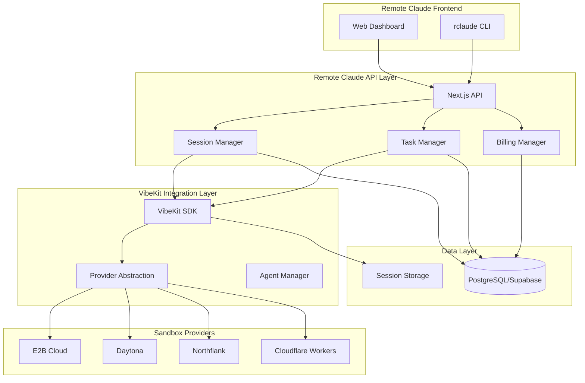
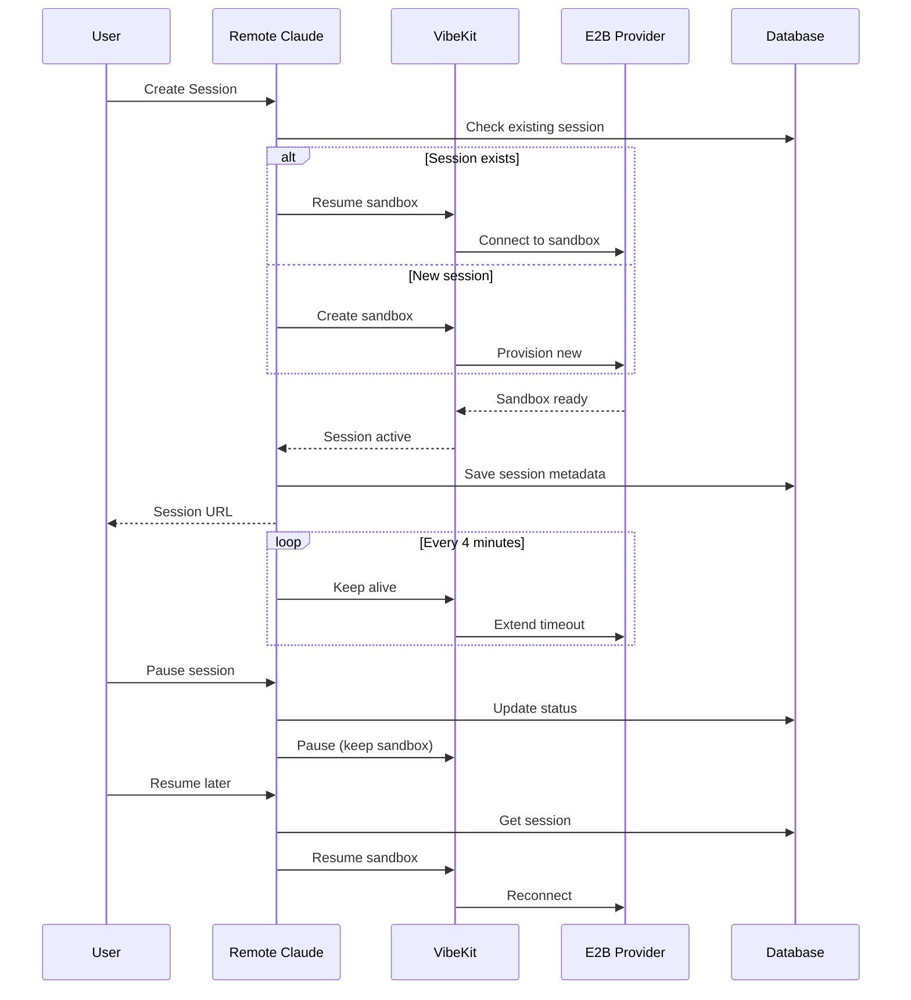
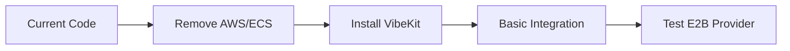
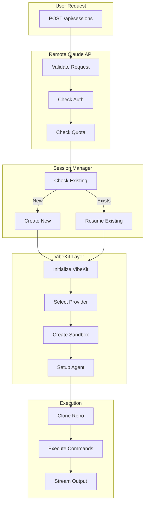

# Remote Claude + VibeKit Integration Architecture

## Executive Summary

Remote Claude will leverage VibeKit as its core execution engine, replacing the complex AWS ECS/EC2 infrastructure with VibeKit's proven sandbox abstraction layer. This provides immediate access to multiple sandbox providers (E2B, Daytona, Northflank, Cloudflare) while maintaining our unique value propositions around persistent sessions, repository management, and developer-focused UX.

## Architecture Overview



## Integration Components

### 1. VibeKit SDK Integration

```typescript
// src/core/vibekit/integration.ts
import { VibeKit } from '@vibe-kit/vibekit';
import { createE2BProvider } from '@vibe-kit/e2b';

export class RemoteClaudeVibeKit {
  private vibekit: VibeKit;
  
  constructor(config: RemoteClaudeConfig) {
    // Primary provider: E2B (most mature, best docs)
    const provider = createE2BProvider({
      apiKey: process.env.E2B_API_KEY,
      templateId: 'vibekit-claude'
    });
    
    this.vibekit = new VibeKit()
      .withAgent({
        type: 'claude',
        provider: 'anthropic',
        apiKey: config.anthropicKey,
        model: 'claude-3-5-sonnet-20241022'
      })
      .withSandbox(provider)
      .withGithub({
        token: config.githubToken,
        repository: config.repository
      });
  }
}
```

### 2. Session Persistence Layer

```typescript
// How Remote Claude adds value on top of VibeKit
interface PersistentSession {
  // VibeKit provides
  sandboxId: string;        // E2B sandbox ID
  agentSession: string;     // Claude session
  
  // Remote Claude adds
  userId: string;           // User ownership
  projectId: string;        // Project grouping
  environment: {            // Saved environment
    variables: Record<string, string>;
    packages: string[];
    systemConfig: any;
  };
  history: Command[];       // Command history
  files: FileSnapshot[];    // File state tracking
  billing: {               // Usage tracking
    hoursUsed: number;
    tokensUsed: number;
  };
}
```

## Key Integration Points

### 1. Repository Management

**VibeKit Provides:**
- Git clone into sandbox
- Basic file operations

**Remote Claude Adds:**
- Repository metadata management
- Branch tracking and switching
- Persistent file state across sessions
- Smart caching of dependencies

```typescript
class RepositoryManager {
  async setupRepository(repo: string, session: Session) {
    // VibeKit handles cloning
    await this.vibekit.sandbox.clone(repo);
    
    // Remote Claude adds persistence
    await this.saveRepoState(session.id, {
      url: repo,
      branch: await this.getCurrentBranch(),
      lastCommit: await this.getLastCommit(),
      dependencies: await this.extractDependencies()
    });
  }
}
```

### 2. Session Lifecycle



### 3. Billing Integration

```typescript
interface BillingModel {
  // VibeKit costs (pass-through)
  sandboxCost: {
    provider: 'e2b' | 'daytona' | 'northflank';
    hourlyRate: number;  // E2B: ~$0.04/hour
    actualUsage: number;
  };
  
  // Claude API costs (pass-through)
  llmCost: {
    inputTokens: number;
    outputTokens: number;
    rate: number;  // Anthropic pricing
  };
  
  // Remote Claude margin
  platformFee: {
    percentMarkup: 20;  // 20% margin on costs
    minimumCharge: 0.10; // Min $0.10/hour
  };
  
  // Storage costs
  persistenceCost: {
    monthly: 5.00;  // $5/month per repo
    included: '10GB';
  };
}
```

## Migration Path

### Phase 1: Core Integration (Week 1)


### Phase 2: Feature Parity (Week 2)
- Session management
- Repository operations
- File persistence
- Basic billing

### Phase 3: Enhanced Features (Week 3)
- Multi-provider support
- Advanced caching
- Performance optimization
- Monitoring

### Phase 4: Launch (Week 4)
- Production deployment
- Migration tools
- Documentation
- Marketing

## Technical Decisions

### Why E2B as Primary Provider?

| Provider | Pros | Cons | Decision |
|----------|------|------|----------|
| **E2B** | • Best documentation<br>• Reliable API<br>• Good pricing<br>• Fast provisioning | • Limited regions<br>• No GPU support | ✅ **PRIMARY** |
| Daytona | • Open source<br>• Self-hostable | • Less mature<br>• More complex | Secondary |
| Northflank | • Good scaling<br>• EU presence | • More expensive<br>• Complex setup | Enterprise |
| Cloudflare | • Edge native<br>• Fast | • Workers only<br>• Limited | Special use |

### Data Flow Architecture



## API Mappings

### Remote Claude API → VibeKit SDK

| Remote Claude Endpoint | VibeKit Method | Notes |
|----------------------|----------------|-------|
| `POST /api/sessions` | `new VibeKit().withSandbox()` | Create session |
| `GET /api/sessions/:id` | `vibekit.getSession()` | Get status |
| `POST /api/sessions/:id/execute` | `vibekit.executeCommand()` | Run command |
| `POST /api/sessions/:id/chat` | `vibekit.generateCode()` | Claude interaction |
| `GET /api/sessions/:id/files` | `vibekit.sandbox.filesystem` | File operations |
| `DELETE /api/sessions/:id` | `vibekit.kill()` | Terminate |
| `POST /api/sessions/:id/pause` | `vibekit.pause()` | Pause session |
| `POST /api/sessions/:id/resume` | `vibekit.resume()` | Resume session |

## Security Considerations

### VibeKit Security Features
- **Sandbox Isolation**: Complete process isolation
- **No Network Access**: Sandboxes can't access external networks
- **Resource Limits**: CPU, memory, disk limits enforced
- **Temporary Storage**: Sandboxes are ephemeral

### Remote Claude Additions
- **User Authentication**: Supabase Auth
- **API Key Encryption**: AES-256 for stored keys
- **Rate Limiting**: Per-user and per-IP
- **Audit Logging**: All operations logged
- **Data Encryption**: TLS in transit, encrypted at rest

## Performance Optimization

### Caching Strategy
```typescript
class CacheManager {
  // Cache sandbox templates
  async getCachedTemplate(repo: string) {
    const hash = await this.getRepoHash(repo);
    return this.cache.get(`template:${hash}`);
  }
  
  // Cache dependencies
  async cacheDependencies(sandbox: Sandbox) {
    const deps = await this.extractDeps();
    await this.cache.set(`deps:${sandbox.id}`, deps);
  }
  
  // Warm start optimization
  async warmStart(session: Session) {
    // Pre-pull Docker images
    await this.pullImages(['vibekit-claude']);
    // Pre-install common packages
    await this.preInstallPackages(['typescript', 'jest']);
  }
}
```

### Performance Metrics

| Metric | Target | VibeKit Baseline | With Optimization |
|--------|--------|------------------|-------------------|
| Session Start | <30s | 20-25s (E2B) | 15-20s (cached) |
| Command Latency | <100ms | 50-80ms | 40-60ms |
| File Operation | <500ms | 200-300ms | 150-200ms |
| Clone Repository | <60s | 30-45s | 20-30s (cached) |

## Monitoring & Observability

```typescript
interface Metrics {
  // VibeKit metrics
  sandboxMetrics: {
    createTime: number;
    cpuUsage: number;
    memoryUsage: number;
    diskUsage: number;
  };
  
  // Remote Claude metrics
  sessionMetrics: {
    totalSessions: number;
    activeSessions: number;
    averageDuration: number;
    successRate: number;
  };
  
  // Business metrics
  businessMetrics: {
    revenue: number;
    costs: number;
    margin: number;
    churn: number;
  };
}
```

## Cost Analysis

### Per-Session Economics

```
E2B Sandbox:        $0.04/hour
Claude API:         ~$0.02/hour (average)
Infrastructure:     $0.01/hour (Vercel, Supabase)
-------------------------------------------
Total Cost:         $0.07/hour
Selling Price:      $0.10/hour
Gross Margin:       30%

With $5/month storage subscription:
- Average user: 50 hours/month = $5.00
- Storage subscription: $5.00
- Total Revenue: $10.00/user/month
- Total Cost: $3.50 + $0.50 = $4.00
- Gross Margin: 60%
```

## Implementation Checklist

- [ ] Set up E2B account and API keys
- [ ] Install VibeKit SDK dependencies
- [ ] Create VibeKit integration module
- [ ] Implement session manager with VibeKit
- [ ] Add repository management layer
- [ ] Build file persistence system
- [ ] Integrate billing calculations
- [ ] Add monitoring and logging
- [ ] Create migration scripts
- [ ] Write comprehensive tests
- [ ] Deploy to staging
- [ ] Performance testing
- [ ] Security audit
- [ ] Production deployment

## Conclusion

The VibeKit integration provides Remote Claude with:
1. **Immediate sophisticated sandbox infrastructure** without maintaining it
2. **Multiple provider options** for different use cases
3. **Proven reliability** from VibeKit's existing deployments
4. **Cost-effective scaling** with pass-through pricing
5. **Focus on UX differentiation** rather than infrastructure

This architecture allows Remote Claude to launch in 4 weeks with enterprise-grade infrastructure while focusing on the unique value propositions of persistent sessions, repository management, and developer experience.