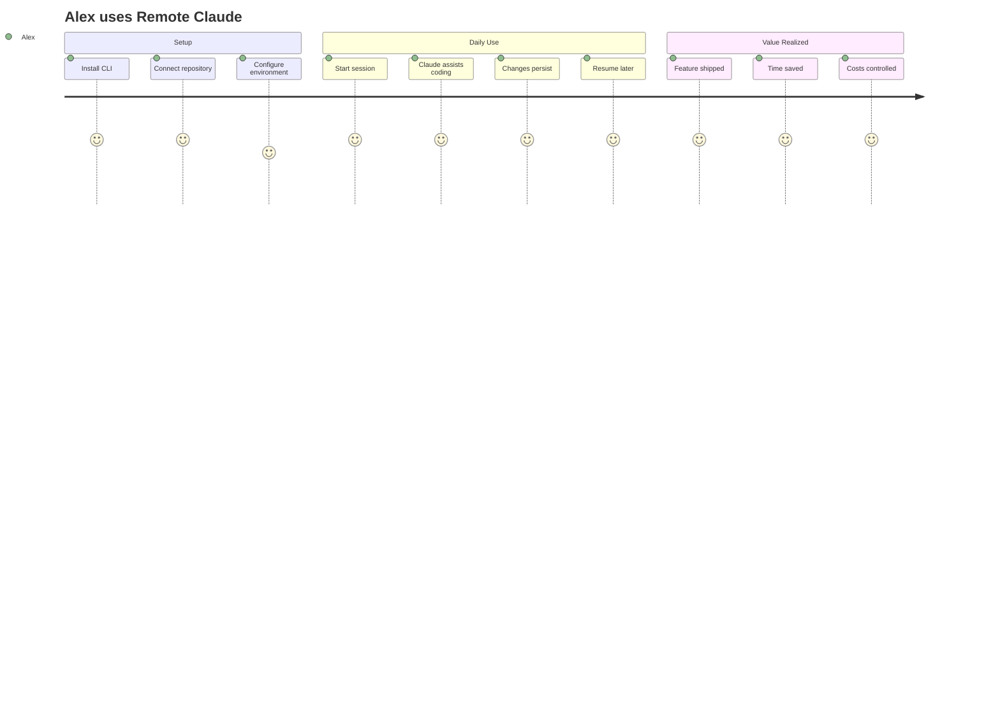

# Remote Claude v2 - Product Requirements Document

## Executive Summary

Remote Claude is a cloud-based development platform that enables developers to run Claude Code in persistent, configurable cloud environments with their own repositories. Built on VibeKit's secure sandbox infrastructure, it eliminates local resource constraints while providing a seamless, cost-effective solution for AI-assisted development.

## 1. Problem Definition

### Core Problem
Developers need to run Claude Code on their repositories but face critical limitations:
- **Local resource constraints** prevent running complex AI coding tasks
- **No persistence** - losing context between sessions wastes time
- **Repository access** - difficulty getting Claude to work with private/custom repos
- **Configuration rigidity** - can't customize the environment for specific needs
- **Cost barriers** - existing cloud solutions are expensive for individual developers

### Current Alternatives & Their Shortcomings
| Alternative | Limitation |
|------------|------------|
| Local Claude Code | Limited by local machine resources, no persistence |
| GitHub Codespaces | Expensive, tied to GitHub, limited AI integration |
| Manual cloud VMs | Complex setup, no Claude integration, expensive |
| Replit/CodeSandbox | Not designed for Claude, limited customization |

### Why Now?
- VibeKit provides production-ready sandbox infrastructure
- Claude Code adoption is growing rapidly
- Developers increasingly need AI assistance for complex tasks
- Cost of cloud compute has decreased
- Remote development is now mainstream post-COVID

## 2. Solution Overview

### Product Vision
**"Run Claude Code on any repository, in any environment, without limits"**

### Core Value Proposition
Remote Claude provides developers with:
1. **Persistent Environments** - Your work persists between sessions
2. **Repository Freedom** - Use any git repository (public/private)
3. **Unlimited Resources** - No local machine constraints
4. **Custom Configuration** - Tailor environments to your needs
5. **Pay-per-use Pricing** - Only pay for what you use

### Key Differentiators
- **VibeKit-powered** - Enterprise-grade security and reliability
- **Repository-centric** - Optimized for real codebases, not demos
- **Developer-first** - Built by developers, for developers
- **Simple pricing** - No complex tiers or hidden costs

## 3. Target User

### Primary Persona: Individual Developer "Alex"
- **Role**: Full-stack developer / Indie hacker / OSS maintainer
- **Pain Points**:
  - Laptop struggles with large codebases
  - Loses context switching between projects
  - Needs different environments for different projects
  - Budget-conscious about cloud costs
- **Goals**:
  - Ship features faster with AI assistance
  - Work on multiple projects efficiently
  - Keep costs predictable and low
- **Usage Pattern**:
  - 10-20 sessions per month
  - 2-4 hour sessions
  - 2-3 active repositories

### User Journey


## 4. Product Requirements

### Functional Requirements

#### 4.1 Core Platform
| ID | Requirement | Priority | Acceptance Criteria |
|----|------------|----------|-------------------|
| F1 | Repository upload & cloning | P0 | User can connect any git repository via URL or upload |
| F2 | Persistent sandbox environments | P0 | Work persists between sessions for at least 30 days |
| F3 | Claude Code execution | P0 | Full Claude Code capabilities in sandbox |
| F4 | Environment configuration | P0 | Users can specify runtime, dependencies, env vars |
| F5 | Real-time session streaming | P0 | See Claude's actions in real-time via WebSocket |

#### 4.2 User Interface
| ID | Requirement | Priority | Acceptance Criteria |
|----|------------|----------|-------------------|
| U1 | CLI for session management | P0 | Start/stop/resume sessions via `rclaude` command |
| U2 | Web dashboard | P1 | View active sessions, costs, and logs |
| U3 | VS Code extension | P2 | Connect to remote session from VS Code |
| U4 | Session sharing | P2 | Share read-only session link with others |

#### 4.3 VibeKit Integration
| ID | Requirement | Priority | Acceptance Criteria |
|----|------------|----------|-------------------|
| V1 | Sandbox provisioning | P0 | Provision VibeKit sandbox in <30 seconds |
| V2 | Multiple providers | P1 | Support E2B, Northflank, Modal providers |
| V3 | Custom agents | P2 | Allow custom Claude configurations |
| V4 | Resource monitoring | P1 | Track CPU, memory, storage usage |

### Non-Functional Requirements

| Category | Requirement | Target |
|----------|------------|--------|
| Performance | Session startup time | < 30 seconds |
| Performance | Command latency | < 100ms |
| Reliability | Uptime | 99.9% |
| Security | Data encryption | AES-256 at rest, TLS in transit |
| Security | Sandbox isolation | Complete process isolation |
| Scalability | Concurrent users | 1,000+ |
| Compliance | Data residency | US/EU options |

### Constraints & Non-Goals

**What we WON'T do (for now):**
- ❌ Team collaboration features (focus on individual developers)
- ❌ Manage our own infrastructure (use VibeKit)
- ❌ Support non-Claude AI models (Claude-first)
- ❌ Built-in IDE (integrate with existing tools)
- ❌ CI/CD features (focus on development)
- ❌ Free tier (sustainable business from day 1)

## 5. Architecture & Technical Design

### High-Level Architecture
```
┌──────────────┐     ┌──────────────┐     ┌──────────────┐
│   CLI/Web    │────▶│   API Layer  │────▶│   VibeKit    │
│   Client     │     │   (Next.js)  │     │   SDK        │
└──────────────┘     └──────────────┘     └──────────────┘
                              │                    │
                              ▼                    ▼
                     ┌──────────────┐     ┌──────────────┐
                     │   Database   │     │   Sandbox    │
                     │  (Postgres)  │     │  Providers   │
                     └──────────────┘     └──────────────┘
```

### Key Technical Decisions
1. **VibeKit as core infrastructure** - Eliminate infrastructure complexity
2. **Next.js for API + Web** - Single deployment, full-stack TypeScript
3. **PostgreSQL for state** - Simple, reliable, scalable
4. **Stripe for billing** - Industry standard, developer-friendly
5. **Vercel for hosting** - Optimized for Next.js, great DX

### Data Model
```typescript
// Core entities
interface User {
  id: string;
  email: string;
  stripeCustomerId: string;
  usage: UsageMetrics;
}

interface Session {
  id: string;
  userId: string;
  repository: Repository;
  sandboxId: string;  // VibeKit sandbox
  status: 'active' | 'paused' | 'terminated';
  startedAt: Date;
  lastActiveAt: Date;
}

interface Repository {
  id: string;
  url: string;
  branch: string;
  privateKey?: string;  // For private repos
  environment: EnvironmentConfig;
}
```

## 6. Business Model & Pricing

### Revenue Model

#### Pricing Strategy: Simple Usage-Based
- **$0.10 per hour** of active session time
- **$5/month** for persistent storage (per repository)
- **No minimums, no subscriptions**

#### Path to $1,000 MRR (3 months)
| Month | Users | Avg Hours/User | Storage Subs | Revenue |
|-------|-------|----------------|--------------|---------|
| Month 1 | 20 | 30 | 10 | $110 |
| Month 2 | 50 | 40 | 30 | $350 |
| Month 3 | 100 | 50 | 80 | $1,000 |

**Key Assumptions:**
- 10% week-over-week growth
- $15 average revenue per user
- 80% of users opt for persistent storage

### Customer Acquisition Strategy
1. **Launch on developer platforms** (HN, Reddit, Dev.to)
2. **Create compelling demos** with popular repos
3. **Partner with Claude influencers** for tutorials
4. **Open source the CLI** for trust and adoption
5. **Referral program** - 1 month free for referrals

## 7. Success Metrics

### Primary KPIs (3-month targets)
| Metric | Target | Measurement |
|--------|--------|-------------|
| Monthly Recurring Revenue | $1,000 | Stripe dashboard |
| Active Users | 100 | Weekly active sessions |
| Session Success Rate | >95% | Completed without errors |
| Customer Acquisition Cost | <$30 | Marketing spend / new users |
| User Retention (Month 2) | >60% | Cohort analysis |

### Leading Indicators
- Sign-ups per week
- Session duration trends
- Repository diversity
- Support ticket volume
- CLI downloads

### User Satisfaction
- NPS score > 50
- Support response time < 2 hours
- Session startup time < 30s
- Error rate < 5%

## 8. MVP Scope (Launch in 4 weeks)

### Week 1-2: Core Infrastructure
- [ ] VibeKit integration for sandbox management
- [ ] Basic CLI for session start/stop
- [ ] Repository cloning and persistence
- [ ] PostgreSQL setup for user/session data

### Week 3: User Experience
- [ ] CLI polish and error handling
- [ ] Basic web dashboard (session list)
- [ ] Billing integration with Stripe
- [ ] Documentation site

### Week 4: Launch Preparation
- [ ] Load testing and optimization
- [ ] Security audit
- [ ] Launch materials (blog post, demo video)
- [ ] Support system setup

### Post-MVP Roadmap
**Month 2:**
- Advanced environment configuration
- VS Code extension
- Session sharing
- Multiple sandbox providers

**Month 3:**
- Performance optimizations
- Advanced monitoring dashboard
- Referral program
- Enterprise features planning

## 9. Risks & Mitigations

| Risk | Impact | Probability | Mitigation |
|------|--------|-------------|------------|
| VibeKit dependency | High | Low | Maintain abstraction layer, have backup provider |
| Slow adoption | High | Medium | Aggressive marketing, free credits for early users |
| Security breach | High | Low | Use VibeKit's security, regular audits |
| High costs | Medium | Medium | Optimize resource usage, pass-through pricing |
| Claude API changes | Medium | Low | Stay close to Anthropic, version lock |

## 10. Implementation Plan

### Code Cleanup (Week 0)
```bash
# Components to remove
- src/services/compute/providers/ecs-ec2/*
- src/cli/commands/ec2.ts
- src/cli/commands/ecs.ts
- All AWS-specific infrastructure code

# Components to keep
- CLI framework (src/cli/*)
- Task management (src/tasks/*)
- Configuration system (src/cli/utils/config-v2.ts)
- Web UI components (website/*)
```

### New Architecture
```bash
# New structure
src/
  core/
    vibekit/      # VibeKit integration
    sessions/     # Session management
    repos/        # Repository handling
  api/
    routes/       # Next.js API routes
  cli/
    commands/     # CLI commands (simplified)
  web/
    dashboard/    # Web dashboard
```

### Migration Strategy
1. **Create new branch** for v2 development
2. **Remove ECS/EC2 code** to reduce complexity
3. **Integrate VibeKit SDK** as core dependency
4. **Adapt existing CLI** to use new backend
5. **Simplify configuration** to focus on essentials
6. **Deploy MVP** on Vercel

## 11. Go-to-Market Strategy

### Launch Plan (Week 5)
1. **Soft launch** to 50 beta users
2. **Hacker News** launch post
3. **Twitter/X thread** with demo video
4. **Dev.to article** tutorial
5. **Reddit** posts in relevant communities

### Messaging & Positioning
**Headline:** "Run Claude Code on any repo, without limits"

**Key Messages:**
- No more "out of memory" errors
- Your work persists between sessions
- Pay only for what you use
- Enterprise-grade security with VibeKit

### Competition Positioning
| Competitor | Our Advantage |
|------------|---------------|
| Local Claude | Unlimited resources, persistence |
| GitHub Codespaces | 10x cheaper, Claude-optimized |
| Replit | Better for real projects, not toys |

## 12. Success Criteria

### 3-Month Success
✅ $1,000 MRR achieved
✅ 100+ active users
✅ <5% churn rate
✅ Positive user feedback
✅ Clear path to profitability

### 6-Month Vision
- $5,000 MRR
- 500+ active users
- VS Code extension launched
- Team features in development
- Series of case studies published

### 12-Month Vision
- $20,000 MRR
- 2,000+ active users
- Profitable operations
- Enterprise tier launched
- Multiple AI model support

## Appendix

### A. Glossary
- **VibeKit**: SDK for running AI agents in secure sandboxes
- **Sandbox**: Isolated environment for code execution
- **Claude Code**: Anthropic's AI coding assistant
- **MRR**: Monthly Recurring Revenue

### B. References
- [VibeKit Documentation](https://github.com/superagent-ai/vibekit)
- [Claude Code Capabilities](https://claude.ai/code)
- [Sandbox Provider Comparison](./docs/sandbox-providers.md)

### C. Open Questions
1. Should we support team features in the future?
2. What's the optimal pricing for enterprise?
3. Should we add a free tier once profitable?
4. How do we handle abuse/mining?

---

*Document Version: 2.0*
*Last Updated: December 2024*
*Owner: Product Team*
*Status: In Review*