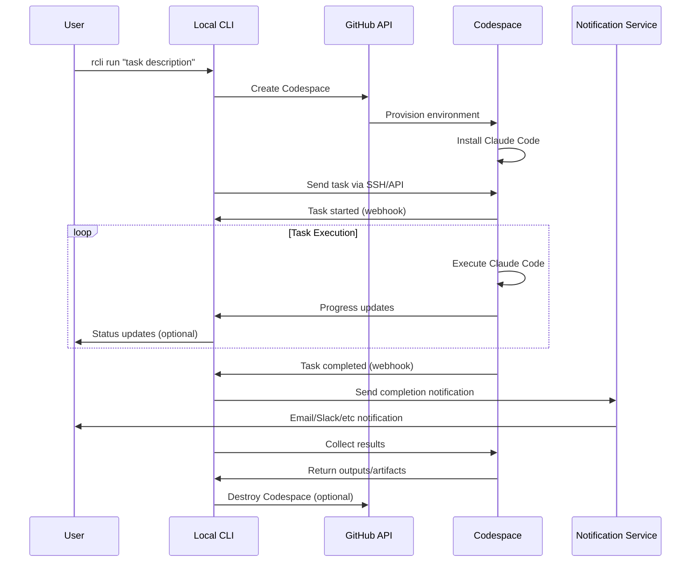

## System Components

### 1. Local CLI (`rcli`)

**Purpose**: Command-line interface for managing remote Claude Code tasks

**Components**:
- **Task Manager**: Queues and tracks tasks
- **Codespace Controller**: Manages Codespace lifecycle
- **Notification Handler**: Sends alerts and updates
- **Config Manager**: Handles authentication and settings
- **Result Processor**: Downloads and processes task outputs

**Key Responsibilities**:
- Parse user commands and validate inputs
- Authenticate with GitHub API
- Create and configure Codespaces
- Monitor task status via webhooks/polling
- Handle notification delivery
- Manage local task history and results

### 2. GitHub Codespaces Runtime

**Purpose**: Isolated execution environment for Claude Code tasks

**Components**:
- **Claude Code**: The actual AI assistant
- **Task Runner**: Wrapper that executes Claude Code with task context
- **Status API**: HTTP endpoint for reporting task progress
- **Result Collector**: Gathers outputs, logs, and artifacts
- **Git Handler**: Manages code commits and branch operations

**Key Responsibilities**:
- Provide isolated, reproducible environment
- Execute Claude Code with proper context
- Report status updates to local CLI
- Save all outputs and intermediate results
- Handle git operations (commits, PRs, etc.)

### 3. Communication Layer

**Purpose**: Enable reliable communication between local CLI and remote Codespace

**Components**:
- **GitHub API**: Codespace management and file operations
- **Webhook Server**: Receives status updates from Codespace
- **Polling Service**: Fallback for status monitoring
- **SSH Tunnel**: Direct communication channel (optional)

### 4. Notification System

**Purpose**: Alert users when tasks complete or require attention

**Supported Channels**:
- **Email/SMTP**: Standard email notifications
- **Slack**: Team chat integration
- **Discord**: Community/personal notifications
- **Webhooks**: Custom integrations
- **Push Notifications**: Mobile alerts (via services like Pushover)

## Data Flow



## File Structure

```
remote-claude-cli/
├── src/
│   ├── cli/
│   │   ├── commands/           # CLI command handlers
│   │   ├── config/            # Configuration management
│   │   └── utils/             # Shared utilities
│   ├── codespace/
│   │   ├── manager.ts         # Codespace lifecycle
│   │   ├── provisioner.ts     # Environment setup
│   │   └── communicator.ts    # Remote communication
│   ├── notifications/
│   │   ├── email.ts           # Email provider
│   │   ├── slack.ts           # Slack integration
│   │   └── webhook.ts         # Generic webhook
│   ├── runtime/              # Files deployed to Codespace
│   │   ├── task-runner.ts     # Claude Code wrapper
│   │   ├── status-api.ts      # HTTP status endpoint
│   │   └── setup.sh           # Environment setup script
│   └── types/
│       └── index.ts           # TypeScript definitions
├── templates/
│   ├── devcontainer.json      # Codespace configuration
│   └── claude-setup.sh        # Claude Code installation
└── package.json
```

## Security Considerations

### Authentication
- GitHub Personal Access Tokens for API access
- Secure token storage (OS keychain/credential store)
- Scoped permissions (minimal required access)

### Data Protection
- Encrypted communication channels
- Secure handling of code and sensitive data
- Automatic cleanup of temporary files
- Optional result encryption at rest

### Network Security
- HTTPS for all API communications
- Webhook signature verification
- Optional VPN/private networking for sensitive repos

## Scalability

### Concurrent Tasks
- Support multiple simultaneous Codespaces
- Task queuing and priority management
- Resource limits and quota management

### Performance Optimization
- Codespace templates for faster startup
- Result caching and incremental updates
- Efficient file transfer mechanisms

### Cost Management
- Automatic Codespace destruction after completion
- Configurable timeouts and resource limits
- Usage monitoring and reporting

## Error Handling

### Connection Issues
- Automatic retry with exponential backoff
- Graceful degradation when webhooks fail
- Offline mode for result retrieval

### Task Failures
- Comprehensive error logging
- Partial result recovery
- Retry mechanisms for transient failures

### Resource Limits
- Timeout handling for long-running tasks
- Memory and CPU monitoring
- Graceful shutdown procedures