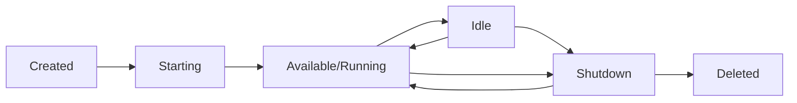

This guide explains how GitHub Codespaces work with Remote Claude and how to optimize their lifecycle for long-running tasks.

## Table of Contents

1. [Lifecycle Overview](#lifecycle-overview)
2. [Timeout Configuration](#timeout-configuration)
3. [Cost Optimization](#cost-optimization)
4. [Remote Claude Integration](#remote-claude-integration)
5. [Best Practices](#best-practices)

## Lifecycle Overview

### Codespace States



| State | Description | Data Preserved | Billable |
|-------|-------------|----------------|----------|
| **Available** | Running and accessible | Yes | Yes |
| **Idle** | No activity detected | Yes | Yes |
| **Shutdown** | Stopped manually or by timeout | Yes | Storage only |
| **Deleted** | Permanently removed | No | No |

### Default Timeouts

- **Idle timeout**: 30 minutes (configurable)
- **Retention period**: 30 days (configurable)
- **Maximum runtime**: No limit (while active)

## Timeout Configuration

### Repository-Level Configuration

Create `.devcontainer/devcontainer.json` in your repository:

```json
{
  "name": "Remote Claude Environment",
  "image": "mcr.microsoft.com/devcontainers/universal:linux",
  "features": {
    "ghcr.io/devcontainers/features/node:1": {},
    "ghcr.io/devcontainers/features/sshd:1": {}
  },
  "codespaces": {
    "idleTimeout": 240,  // 4 hours
    "repositories": {
      "l2succes/remote-claude": {
        "permissions": {
          "contents": "write"
        }
      }
    }
  },
  "postCreateCommand": "npm install -g @anthropic-ai/claude-code && tmux new-session -d -s claude-work"
}
```

### User-Level Settings

1. Go to [github.com/settings/codespaces](https://github.com/settings/codespaces)
2. Set default timeout (up to organization limit)
3. Configure retention period

### Organization-Level Policies

For organization repos:
1. Organization Settings → Codespaces
2. Set maximum idle timeout
3. Configure retention policies
4. Set spending limits

## Cost Optimization

### Understanding Costs

| Resource | Cost | Free Tier (Personal) |
|----------|------|---------------------|
| **Compute** | $0.08-0.89/hour | 120 core hours/month |
| **Storage** | $0.07/GB/month | 15 GB-months |
| **Prebuilds** | Same as compute | Included in quota |

### Cost Calculation Examples

**Example 1: Overnight Task (8 hours)**
- Machine: 2-core basic ($0.08/hour)
- Cost: 8 hours × $0.08 = $0.64
- Free tier usage: 16 core hours

**Example 2: Week-long Project**
- Daily usage: 4 hours × 4-core = 16 core hours
- Weekly: 112 core hours (near monthly limit)
- Cost if exceeding: ~$10-20/week

### Optimization Strategies

1. **Use Appropriate Machine Sizes**
   ```bash
   # For simple tasks
   rclaude run "task" --machine-type 2-core
   
   # For complex compilation
   rclaude run "task" --machine-type 8-core
   ```

2. **Stop When Not Needed**
   ```bash
   # Stop manually
   gh codespace stop --codespace <name>
   
   # Auto-stop script
   echo "timeout 4h claude" > run-with-timeout.sh
   ```

3. **Delete Unused Codespaces**
   ```bash
   # List all codespaces
   gh codespace list
   
   # Delete specific
   gh codespace delete -c <name>
   
   # Delete all stopped
   gh codespace list --json name,state | \
     jq -r '.[] | select(.state=="Shutdown") | .name' | \
     xargs -I {} gh codespace delete -c {}
   ```

## Remote Claude Integration

### Configure Idle Timeout in Remote Claude

Add to your task options:

```bash
# Set 4-hour timeout for long tasks
rclaude run "Complex refactoring" \
  --repo owner/repo \
  --codespace-timeout 240 \
  --keep-alive
```

### Keep-Alive Strategies

For tasks that may have idle periods:

```bash
# In your codespace, run keep-alive script
cat > ~/keep-alive.sh << 'EOF'
#!/bin/bash
# Prevent codespace from idle timeout
while true; do
  echo "$(date): Keeping codespace active" >> /tmp/keepalive.log
  # Minimal activity to prevent shutdown
  ls > /dev/null 2>&1
  sleep 300  # 5 minutes
done
EOF

chmod +x ~/keep-alive.sh
nohup ~/keep-alive.sh &
```

### Persistent Session Configuration

Configure tmux to maintain activity:

```bash
# ~/.tmux.conf addition
# Send keepalive every 10 minutes
set -g status-interval 600
```

## Best Practices

### 1. For Long-Running Tasks

```bash
# Use persistent sessions
rclaude run --interactive "8-hour analysis" \
  --repo owner/repo \
  --persistent \
  --notify-on-complete

# Set appropriate timeout
# In .devcontainer/devcontainer.json
{
  "codespaces": {
    "idleTimeout": 480  // 8 hours
  }
}
```

### 2. For Overnight Work

```bash
# Start before leaving
rclaude run "Overnight refactoring" \
  --repo owner/repo \
  --machine-type 4-core \
  --notify email \
  --auto-commit

# Add keep-alive for safety
# In codespace:
nohup bash -c 'while true; do date > /tmp/alive; sleep 300; done' &
```

### 3. For Cost Control

```yaml
# GitHub Actions to cleanup
name: Cleanup Codespaces
on:
  schedule:
    - cron: '0 2 * * *'  # Daily at 2 AM
jobs:
  cleanup:
    runs-on: ubuntu-latest
    steps:
      - name: Delete old codespaces
        run: |
          gh codespace list --json name,lastUsed | \
          jq -r '.[] | select(
            (.lastUsed | fromdateiso8601) < (now - 86400 * 3)
          ) | .name' | \
          xargs -I {} gh codespace delete -c {} --force
```

### 4. For Team Usage

```json
// Organization codespace policy
{
  "idleTimeoutMinutes": 60,
  "retentionPeriodDays": 7,
  "allowedMachineTypes": [
    "basicLinux32gb",
    "standardLinux32gb"
  ],
  "maximumConcurrentCodespaces": 5,
  "maximumIdleTimeoutMinutes": 240
}
```

## Monitoring & Alerts

### Usage Monitoring

```bash
# Check current usage
gh api /user/codespaces --jq '.codespaces[] | {
  name: .name,
  state: .state,
  machine: .machine.display_name,
  created: .created_at,
  last_used: .last_used_at
}'

# Calculate costs
gh api /user/codespaces --jq '
  .codespaces[] | 
  select(.state == "Available") |
  .machine.prebuild_availability
'
```

### Set Up Billing Alerts

1. Go to Settings → Billing → Spending limits
2. Set monthly limit
3. Configure email alerts at 75%, 90%, 100%

## Troubleshooting

### Codespace Stops Unexpectedly

**Causes**:
- Idle timeout reached
- Spending limit hit
- Organization policy
- System maintenance

**Solutions**:
```bash
# Check timeout setting
gh codespace list --json name,idleTimeoutMinutes

# Restart with longer timeout
gh codespace edit -c <name> --idle-timeout 240
```

### Can't Connect After Timeout

```bash
# Check state
gh codespace list

# If shutdown, restart
gh codespace start -c <name>

# Wait for ready state
gh codespace ssh -c <name> -- echo "Ready"
```

### High Costs

1. Review usage:
   ```bash
   # Get usage report
   gh api /user/codespaces --jq '.total_usage'
   ```

2. Optimize:
   - Use smaller machines
   - Reduce idle timeout
   - Delete unused codespaces
   - Use prebuilds efficiently

## Summary

- **Default timeout**: 30 minutes (increase for long tasks)
- **Retention**: 30 days (reduce for cost savings)
- **Free tier**: 120 core hours/month
- **Keep-alive**: Use scripts for critical long-running tasks
- **Monitor costs**: Set spending limits and alerts